# NK Automobiles - ER Diagram Documentation

This document provides a detailed Entity-Relationship (ER) diagram for the **NK AUTOMOBILES – Online Two-Wheeler Spare Parts Management System**.

> [!NOTE]
> The diagram below uses Mermaid syntax to represent the database structure. Many editors (like VS Code with extensions) or GitHub can render this into a visual diagram.

## ER Diagram (Mermaid)

```mermaid
erDiagram
    USERS ||--o{ ORDERS : places
    USERS ||--o{ CART : adds_to
    USERS ||--o{ REVIEWS : writes
    CATEGORIES ||--o{ PRODUCTS : categorizes
    PRODUCTS ||--o{ CART : contained_in
    PRODUCTS ||--o{ REVIEWS : reviewed_in
    PRODUCTS ||--o{ ORDER_ITEMS : part_of
    ORDERS ||--o{ ORDER_ITEMS : contains

    USERS {
        int user_id PK
        string username
        string email
        string password_hash
        string role
        string phone
        string address
        timestamp created_at
    }

    CATEGORIES {
        int category_id PK
        string name
        string description
    }

    PRODUCTS {
        int product_id PK
        string name
        string description
        decimal price
        int stock_quantity
        int category_id FK
        string brand
        string image_url
        timestamp created_at
    }

    CART {
        int cart_id PK
        int user_id FK
        int product_id FK
        int quantity
        timestamp added_at
    }

    REVIEWS {
        int review_id PK
        int user_id FK
        int product_id FK
        int rating
        string comment
        timestamp created_at
    }

    OFFERS {
        int offer_id PK
        string title
        string description
        decimal discount_percentage
        datetime valid_until
    }

    ORDERS {
        int order_id PK
        int user_id FK
        string full_name
        string phone_number
        string address_line1
        string address_line2
        string city
        string state
        string pincode
        decimal total_amount
        string status
        timestamp created_at
    }

    ORDER_ITEMS {
        int order_item_id PK
        int order_id FK
        int product_id FK
        int quantity
        decimal price
    }
```

## Entity and Relationship Explanation

### Core Entities
- **Users**: Stores customer and administrator information.
- **Products**: Contains details of spare parts (name, price, stock).
- **Categories**: Organizes products into groups (e.g., Engine Parts, Electrical).
- **Orders**: Manages customer purchases.

### Symbols Used
- **Rectangle (Entity)**: Represents a table or object (e.g., User, Product).
- **Oval (Attribute)**: Represents a property of an entity (e.g., Name, Price).
- **Diamond (Relationship)**: Represents how entities interact (e.g., User *places* Order).
- **Lines**: Connect entities with cardinality indicating One-to-One, One-to-Many, etc.

## How to save as PDF
To save this document as a PDF:
1. Open this file (`er_diagram.md`) in VS Code.
2. If you have the "Markdown PDF" extension installed, right-click anywhere in the editor and select **Markdown PDF: Export (pdf)**.
3. Alternatively, press `Ctrl+Shift+P`, type "Print", and select a print-to-pdf option if available in your markdown previewer.
